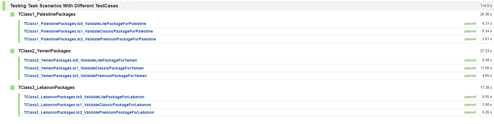

# TestAutomationTask_APAR[Selenium]
 Testing high level scenarios on http://automationpractice.com/index.php  website using Selenium
 , TestNG by applying OOP and applying some of the best practices according to my current knowledge . 
 
# Task Requirements  :- 
1. Navigate to the following URL : https://subscribe.stctv.com/
2. Validate The Subscription Packages Type & Price & Currency

- Using TestNG , DDT Way And a Design Pattern 

# Project Details :-
* Programming Language: Java Maven Project 
* IDE : Intellij
* Frameworks : Selenium + TestNG 
* Data Driven Methodology : By Using Properties
* Number of Pages : 2
* Number Of Test Classes : 3 
* Number Of Test Cases : 9 
* Design Pattern : Fluent Page Object Model & Builder Pattern
* Browser : Chrome 
* Waits : Explicitly Waits 

# TestNG My Results
